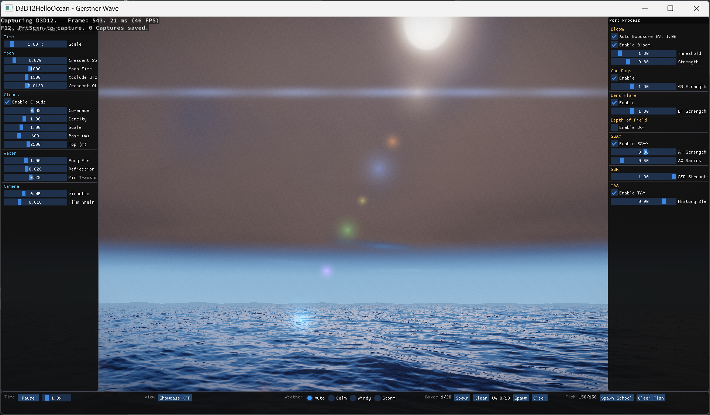

# D3D12 Hello Ocean

A real-time ocean renderer built from scratch with DirectX 12 and C++20. The ocean surface is simulated entirely on the GPU using Fast Fourier Transform (FFT) based on the JONSWAP spectrum, combined with Gerstner waves, volumetric clouds, a full post-processing pipeline, and dynamic weather.

> **Demo video:** <-- https://youtu.be/7AlJAtE4OF4 -->  
> **Build:** Visual Studio 2022 · DirectX 12 · C++20 · Windows 10/11

---

## Screenshots

<!-- Screenshot 1: daytime scene — replace path with your image -->


<!-- Screenshot 2: volumetric clouds / night scene — replace path with your image -->


---

## Technical Highlights

| Feature | Detail |
|---|---|
| Ocean simulation | GPU FFT (JONSWAP spectrum + Cooley-Tukey Radix-2 IFFT) |
| Ocean mesh | Infinite tiled ocean (9×9 tiles, 400 m/tile), frustum culling, 2-level LOD |
| Wave model | FFT displacement map + 4 Gerstner waves |
| Volumetric clouds | Ray-marching, Henyey-Greenstein phase, Beer-Lambert extinction, half-resolution rendering |
| Cloud shadow | Per-surface ray march toward sun — cloud gaps cast bright patches on ocean |
| Sky | Procedural gradient, sun/moon disc, crescent phase, procedural star field |
| Post-processing | TAA · Bloom · God Rays · DOF · SSAO · SSR · Lens Flare · ACES tone mapping |
| Water shading | Beer-Lambert absorption · caustics · refraction · Fresnel · SSS |
| Underwater | Snell's window (critical angle ≈ 48.6°), total internal reflection |
| Render target | HDR (R16G16B16A16_FLOAT) → LDR (R8G8B8A8_UNORM) |

---

## Ocean Simulation Pipeline

The simulation runs as three consecutive compute shader passes each frame:

```
[Startup]
PhillipsCS.hlsl      — Generate initial spectrum H₀(k) from JONSWAP model

[Per Frame]
TimeEvolutionCS.hlsl — Evolve spectrum using dispersion relation ω(k) = √(g|k|)
IFFTCS.hlsl          — Ping-pong Radix-2 IFFT on X then Y axis → spatial height map
```

The resulting displacement texture is sampled in the vertex shader. Surface normals are computed via finite differences for accurate Phong lighting and Fresnel reflection.

---

## Volumetric Clouds

Clouds are rendered as a dedicated fullscreen ray-march pass through a horizontal slab (600 – 2200 m).

### Performance — Half-Resolution Rendering

Ray-marching at full 1920×1080 caused frame drops to ~22 fps when looking at the sky. The solution combines two optimizations for an overall **~8× speedup**:

| Optimization | Detail |
|---|---|
| Half-resolution RT | Clouds rendered at 960×540 (¼ pixel count), upsampled via 4-tap tent filter |
| Step count 64 → 32 | Halved main march iteration cost |
| Skip light march for thin cloud | Density < 0.04 uses a fixed transmittance of 0.85 instead of a 5-step shadow ray |

Bilinear upsampling introduces negligible quality loss on low-frequency cloud content.

### Artifact Fix — Gradient Noise (Perlin-like)

Early versions used **Value Noise**, which stores a scalar at each lattice corner and interpolates. Its isosurfaces are grid-aligned arcs that produce **fingerprint / contour-line patterns**, especially at low coverage:

```
Value Noise isosurface:          Gradient Noise isosurface:

  · · · · ·                        · · · · ·
  · ╭───╮ ·  ← grid-aligned arcs  · ╭──╮  ·  ← organic curves
  · │   │ ·    → fingerprint rings ·  ╰──╯  ·    no grid alignment
  · ╰───╯ ·                        · · · · ·
  · · · · ·
```

**Fix:** Replaced with **Gradient Noise**. Each lattice corner stores a random gradient *vector*; the value is `dot(gradient, offset)`. Isosurfaces follow the gradient direction and are organic curves at any threshold level, eliminating all fingerprint and grid-edge artifacts.

---

## Scene Systems

### Weather
Three presets with smooth parameter interpolation:

| Key | Mode | Effect |
|---|---|---|
| `1` | Calm | Low waves, clear sky |
| `2` | Windy | Larger FFT amplitude, moving clouds |
| `3` | Storm | Maximum wave height, heavy rain |
| `4` | Auto | Cycles between states automatically |

### Rain & Ripples
Up to **2000 rain particles** spawned in a circular area around the camera, with up to **200 water surface ripples** rendered as expanding rings.

### Fish School
CPU **Boids flocking** (separation, alignment, cohesion) driving GPU instanced rendering of up to ~150 fish.

### Floating Objects
Boxes sampled directly from the FFT displacement map — they ride the waves with correct height and tilt. Underwater objects use Beer-Lambert fog.

### Showcase Mode (`V`)
Automated camera demo combining sine oscillation for natural vertical motion, useful for recording footage.

---

## Post-Processing Pipeline

```
HDR scene
  └─ Volumetric Clouds (half-resolution ray-march + composite)
  └─ SSAO
  └─ Screen-Space Reflections (SSR)
  └─ God Rays (64-sample radial blur toward sun)
  └─ Bloom (brightness threshold + Gaussian blur)
  └─ Lens Flare
  └─ Depth of Field
  └─ ACES Tone mapping
  └─ TAA (Halton jitter + history blend)
  └─ LDR output
```

---

## Controls

| Input | Action |
|---|---|
| `W / A / S / D` | Move camera |
| Mouse drag | Rotate camera |
| `V` | Toggle showcase (auto-fly) mode |
| `Tab` | Toggle wireframe |
| ImGui panel (left) | Moon, clouds, water, camera parameters |
| ImGui panel (right) | Post-process: Bloom, DoF, SSAO, SSR, TAA, etc. |
| ImGui bar (bottom) | Time scale, weather, spawn controls |

---

## Build Instructions

**Requirements**
- Windows 10 / 11 (x64)
- Visual Studio 2022 with "Desktop development with C++" workload
- NuGet packages are restored automatically on first build:
  - `Microsoft.Direct3D.D3D12` (Agility SDK)
  - `Microsoft.Direct3D.DXC`

**Steps**
1. Clone the repository
2. Open `D3D12HelloWorld.sln` in Visual Studio 2022
3. Build → Build Solution (`Ctrl+Shift+B`)
4. Run the executable from `HelloTriangle/bin/x64/Debug/`

---

## Project Structure

```
HelloTriangle/
├── Main.cpp                      Entry point (WinMain)
├── D3D12HelloTriangle.h/cpp      Application class, DX12 device setup
└── source/
    ├── OceanFFT.h/cpp            FFT simulation (JONSWAP, time evolution, IFFT)
    ├── Renderer.h/cpp            Infinite tiled ocean mesh, draw calls, cloud shadow CB
    ├── SkyDome.h/cpp             Procedural sky, sun/moon cycle, day-night
    ├── VolumetricClouds.h/cpp    Ray-march clouds (half-res RT, gradient noise)
    ├── WeatherSystem.h/cpp       Weather state machine
    ├── RainSystem.h/cpp          Rain particles (circular spawn) + ripples
    ├── FishSchool.h/cpp          Boids + GPU instancing
    ├── FloatingObject.h/cpp      Wave-riding objects
    └── PostProcessPipeline.h/cpp Full post-process chain

shaders/
├── PhillipsCS.hlsl               Spectrum initialisation (compute)
├── TimeEvolutionCS.hlsl          Per-frame spectrum update (compute)
├── IFFTCS.hlsl                   Inverse FFT (compute)
├── shaders.hlsl                  Ocean surface VS/PS + cloud shadow ray march
├── clouds.hlsl                   Volumetric cloud ray-march + composite
├── skyShaders.hlsl               Sky dome VS/PS
└── ...                           Post-process shaders (bloom, godrays, taa, …)
```

---

## Update Log

| Date | Feature |
|---|---|
| 2026-06-10 | **Lighting smoothing & startup fix** — SkyDome::SmoothLighting() applies a 0.5 s real-time exponential filter to the active sun/moon direction, color and intensity; sky `m_time` initial value moved below the day/night blend band, fixing a moving specular highlight that swept toward the sun during the first seconds after launch |
| 2026-06-10 | **Rainbow effect** — additive post-process pass (primary + secondary bow) driven by rain moisture accumulation and sun elevation |
| 2026-06-10 | Ship-orbit camera mode; continuous AutoExposure ramp with first-frame snap (no startup brightness flash); shadow map sun-direction fix and ship depth pass |
| 2026-06-09 | **IBL (Image-Based Lighting)** — split-sum approximation: cubemap sky capture, SH9 diffuse irradiance, GGX prefiltered specular + BRDF LUT, applied across ocean / ship / floating objects / fish school; warm-start captures all 6 cubemap faces on the first frame to avoid a dark-IBL startup flicker |
| 2026-05-27 | **Ship tilt physics** — CPU spring-damper (5 s natural period, ζ = 0.18) driven by GPU FFT height readback (CopyTextureRegion, 1-frame latency); soft angle limit with progressive restoring force |
| 2026-05-27 | **Weather transitions** — log-space interpolation for phillipsA / windSpeed; 10 s ramp for Calm/Windy/Storm, 20 s for Tsunami; 2-row weather button layout |
| 2026-05-26 | **Ship PBR** — Cook-Torrance GGX BRDF with normal map and ARM (AO/Roughness/Metallic) texture support |
| 2026-05-26 | **Tsunami weather** — extreme wave preset (windSpeed 160, phillipsA 3.5), manual-only mode |
| 2026-05-26 | **GLTF ship model** — runtime GLTF loader (cgltf), multi-group mesh (hull / rigging / sails), shadow map pass |
| 2026-05-17 | **Cloud shadow** — per-surface ray march toward sun using 3-octave FBM; gradient noise replacing value noise to eliminate fingerprint artifacts; rain system fixes; full UI overhaul |
| 2026-05-15 | **Volumetric clouds** — half-resolution ray-marching (8× speedup), Henyey-Greenstein phase, Beer-Lambert extinction |
| 2026-05-12 | JONSWAP spectrum upgrade, fullscreen toggle, 1080p resolution |
| 2026-05-06 | **Fish school** — CPU Boids flocking (separation / alignment / cohesion) driving GPU instanced rendering; underwater Beer-Lambert fog effects; PostProcessPipeline refactor |
| 2026-04-29 | Depth of Field, Lens Flare, Bloom, God Rays post-process effects |
| 2026-04-28 | ImGui UI integration; moon crescent rendering; smooth day/night lighting transition |
| 2026-04-22 | FFT ocean simulation v1.0 — JONSWAP spectrum + Cooley-Tukey Radix-2 IFFT on GPU |
